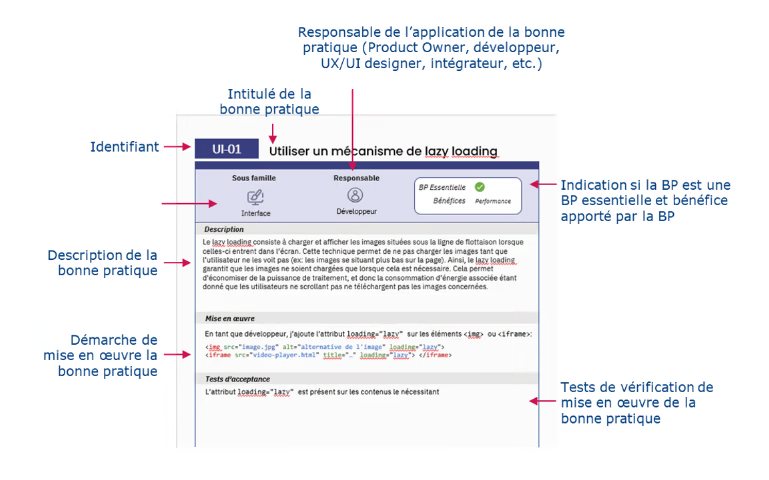

# Référentiel des bonnes pratiques d’écoconception des services numériques

## Contexte
Aujourd’hui, la part du Numérique dans les émissions de gaz à effet de serre mondiales est estimée à 4 %, et ses répercussions écologiques sont multiples et susceptibles de s'accroître. Si rien n’est fait, l'impact carbone du numérique pourrait s'alourdir considérablement, avec une hausse prévue de 60 % d'ici 2040, soit 6,7 % des émissions de GES nationales.

## Notre objetif

Sensibiliser les parties prenantes à l’écoconception des services numériques

Fournir un ensemble de bonnes pratiques à appliquer afin de limiter l’impact environnemental d’un service numérique tout au long de son cycle de vie.

## Public visé

Ce référentiel s’adresse à l’ensemble des parties prenantes intervenant dans le cycle de vie d’un service numérique, par exemple :

* **Le métier**, qui exprime ses besoins
* **Le Product Owne**r, qui traduit les besoins en exigences fonctionnelles
* **Les UX/UI designers**, qui conçoivent l’interface utilisateur
* **Les intégrateurs et développeurs**, qui traduisent les maquettes en code
* **Les Ops**, qui s’assurent de la disponibilité du service numérique

Et toute personne intervenant dans le cycle de vie du service numérique.

## Notre démarche

Ce référentiel d’écoconception s’appuie sur différentes sources et explicite opérationnellement :

* toutes les bonnes pratiques du RGESN ( [référentiel général d’écoconception de services numériques](https://ecoresponsable.numerique.gouv.fr/publications/referentiel-general-ecoconception/) de la DINUM, le MTE, l’ADEME et l’INR )
* Ainsi que quelques bonnes pratiques issues des deux référentiels suivants :
* Le [référentiel des 115 bonnes pratiques](https://github.com/cnumr/best-practices) du Collectif Green IT
* Le [guide d’écoconception de services numériques](https://beta.designersethiques.org/fr/thematique-ecoconception/guide-d-ecoconception) des Designers éthiques

## Organisation du référentiel

Le présent référentiel est organisé en 5 chapitres correspondant chacun aux composants d’un service numérique :

| N° | Nom          | Détails                                                                                    |
| --- | ------------ | ------------------------------------------------------------------------------------------- |
| 1   | Stratégie   | Suivi de la pertinence et des enjeux du service numérique tout au long de son cycle de vie |
| 2   | UX           | Etude du besoin et élaboration des parcours utilisateur                                    |
| 3   | UI           | Elaboration de l’interface utilisateur                                                     |
| 4   | Code         | Développement frontend et backend                                                          |
| 5   | Architecture | Articulation entre les couches techniques du service numérique                             |

**Fiches pratiques**

Chaque bonne pratique est présentée sous la forme d’une fiche synthétique dont la structure est toujours identique.

## Licence
Licence GNU de documentation libre

Version 1.3, 3 novembre 2008
Droits d'auteur © 2000, 2001, 2002, 2007, 2008  Fondation pour le logiciel libre  [http://fsf.org/](http://fsf.org/)

Tout le monde est autorisé à copier et redistribuer à l'identique le texte de cette licence, mais le modifier n'est pas autorisé.

Voir le document Licence.md pour plus de précision
## Code de conduite

Dans l’intérêt de favoriser un environnement ouvert et accueillant, nous nous engageons, en tant que contributeurs et mainteneurs de ce projet, à faire de la participation une expérience exempte de harcèlement pour tout le monde, quel que soit l’âge, la taille corporelle, le handicap visible ou invisible, l’origine ethnique, les caractéristiques sexuelles, l’identité et l’expression de genre, le niveau d’expérience, l’éducation, le statut socio-économique, la nationalité, l’apparence personnelle, la race, la religion ou l’orientation sexuelle.

Voir le document CODE_OF_CONDUCT.md pour plus de précision
## Contribution

- Respecter les templates du projet
- Suivez les conventions de nommage du projet.
- Écrivez des commentaires clairs et concis.
- Verifier votre contribution avant de la soumettre.

Voir le document CONTRIBUTING.md pour plus de précision
