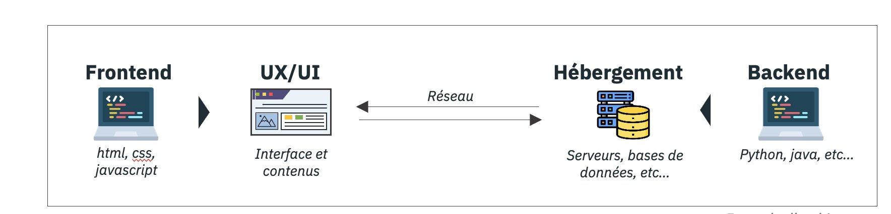

## ARCHITECTURE

Un service numérique est composé de plusieurs couches techniques (design, code frontend, code backend, etc.). Dans ce chapitre, l’architecture se définit comme l’articulation des composants entre ces différentes couches techniques.
L’architecture se décline en grands principes, lignes directrices qui structurent l’organisation globale du service numérique. Elle est composée de données qui transitent entre les composants applicatifs via le réseau. Le tout repose sur une infrastructure matérielle (serveurs, unités de stockage, équipements de réseau et de télécommunication, etc.).

*Exemple d'architecture*

L’objectif des bonnes pratiques d’architecture est, avant tout, de :

- **Rationnaliser et rallonger la durée de vie de l’infrastructure matérielle**, pour limiter l’impact environnemental associé à la fabrication de nouveaux équipements.
- **Minimiser le volume de données et optimiser leur échange**, pour limiter les impacts liés à leur transport, transformation, stockage, etc.

Sous familles traitées dans ce chapitre :

- Principes d’architecture
- Données
- Réseau

| AR-00 | BONNES PRATIQUES TRAITEES DANS CE CHAPITRE                                                             |
| ----- | ------------------------------------------------------------------------------------------------------ |
| AR-01 | Cartographier et classifier les données    |
| AR-02 | Vérifier l'existence des données avant de créer une structure de données ad hoc   |
| AR-03 | Réutiliser les datasets |
| AR-04 | Définir une politique de cycle de vie des données et l'appliquer  |
| AR-05 | Optimiser la structure du modèle de données   |
| AR-06 | Optimiser les requêtes et les accès aux données nécessaires aux stricts nécessaire    |
| AR-07 | Utiliser un format de données adapté  |
| AR-08 | Utiliser un système de stockage adapté au besoin  |
| AR-09 | Utiliser des mécanismes de déduplication des données  |
| AR-10 | Centraliser les données de log, de trace et de monitoring |
| AR-11 | Privilégier une architecture cloud native |
| AR-12 | Opter pour une architecture capable de passer à l'échelle automatiquement |
| AR-13 | Utiliser les bons outils hardware |
| AR-14 | Modifier le workload pour qu’il fonctionne avec des CPU et quantités de mémoire différent   |
| AR-15 | Maximiser l'utilisation des caches HTTP   |
| AR-16 | Compresser les flux HTTP  |
| AR-17 | Protocole de transport    |
| AR-18 | Utiliser un protocole d'échange adapté au contenu transféré   |
| AR-19 | Limiter les données stockées  |
| AR-20 | Privilégier les technologies standard interopérables  |
| AR-21 | Utiliser la CI/CD de manière responsable  |
