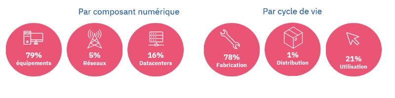
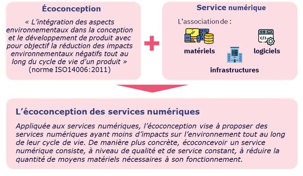

# LE NUMÉRIQUE RESPONSABLE

Aujourd’hui, **la part du Numérique dans les émissions de gaz à effet de serre mondiales est estimée à 4 %**, et ses répercussions écologiques sont multiples et susceptibles de s'accroître. Si rien n’est fait, l'impact carbone du numérique pourrait s'alourdir considérablement, avec une hausse prévue de 60 % d'ici 2040, soit 6,7 % des émissions de GES nationales.

Pour illustrer, en 2020 la répartition de l’empreinte carbone du numérique représentait :

Un des axes de travail pour réduire le poids du numérique est l’écoconception

